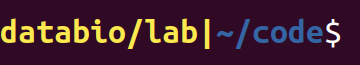
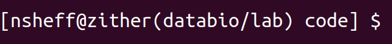
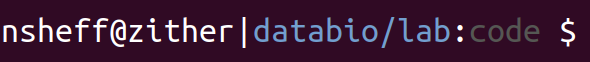
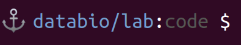
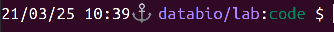

# Customizing bulker prompts

By default, when you activate a crate, bulker will change your prompt. You can customize it. Here are some examples that show you how to customize it.

In these examples we'll activate the crate like this:

```console
bulker activate databio/lab
```

The variables that could be displayed are these:

- namespace: `databio`
- crate name: `lab`
- username: `nsheff`
- host: `zither`
- working directory: `code`

# Default prompt

The default bulker prompt shows you the name of the crate you've activated, colored in yellow. It's the equivalent of putting this in your config.

```yaml
  shell_prompt: '\[\033[01;93m\]\b|\[\033[00m\]\[\033[01;34m\]\w\[\033[00m\]\$ '
```




## Include username and hostname

```yaml
  shell_prompt: '[\u@\h(\b) \W] $ '
```



## Change colors

You can use any terminal colors compatible with your terminal. 


```yaml
  shell_prompt: '\u@\h|\e[94m\b\[\e[00m\]:\e[90m\W\e[39m $ '
```




## Emoji

Yes, you can even put emoji in your prompt, if that's your thing:

```yaml
  shell_prompt: '⚓ \e[94m\b\[\e[00m\]:\e[90m\W\e[39m $ '
```




## Date/time

Also switched to using 256-color codes here:

```yaml
  shell_prompt: '\D{%y/%m/%d %H:%M}⚓ \e[38;5;141m\b\[\e[00m\]:\e[38;5;29m\W\e[39m $ '
```


